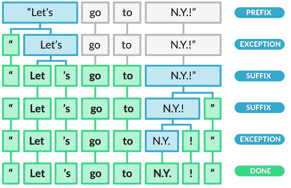

#

spaCy introduces a novel tokenization algorithm that gives a better balance between performance, ease of definition and ease of alignment into the original string.

After consuming a prefix or suffix, we consult the special cases again. We want the special cases to handle things like “don’t” in English, and we want the same rule to work for “(don’t)!“. We do this by splitting off the open bracket, then the exclamation, then the closed bracket, and finally matching the special case. Here’s an implementation of the algorithm in Python optimized for readability rather than performance:

wget --output-document=spacytokenizer_flowchart.svg https://spacy.io/tokenization-9b27c0f6fe98dcb26239eba4d3ba1f3d.svg
## The algorithm can be summarized as follows:

    1. Iterate over space-separated substrings.
    2. Look for a token match. If there is a match, stop processing and keep this token.
    3. Check whether we have an explicitly defined special case for this substring. If we do, use it.
    4. Otherwise, try to consume one prefix. If we consumed a prefix, go back to #2, so that the token match and special cases always get priority.
    5. If we didn’t consume a prefix, try to consume a suffix and then go back to #2.
    6. If we can’t consume a prefix or a suffix, look for a URL match.
    7. If there’s no URL match, then look for a special case.
    8. Look for “infixes” – stuff like hyphens etc. and split the substring into tokens on all infixes.
    9. Once we can’t consume any more of the string, handle it as a single token.
    10. Make a final pass over the text to check for special cases that include spaces or that were missed due to the incremental processing of affixes.




## Code

```python
def tokenizer_pseudo_code(
    text,
    special_cases,
    prefix_search,
    suffix_search,
    infix_finditer,
    token_match,
    url_match
):
    tokens = []
    for substring in text.split():
        suffixes = []
        while substring:
            while prefix_search(substring) or suffix_search(substring):
                if token_match(substring):
                    tokens.append(substring)
                    substring = ""
                    break
                if substring in special_cases:
                    tokens.extend(special_cases[substring])
                    substring = ""
                    break
                if prefix_search(substring):
                    split = prefix_search(substring).end()
                    tokens.append(substring[:split])
                    substring = substring[split:]
                    if substring in special_cases:
                        continue
                if suffix_search(substring):
                    split = suffix_search(substring).start()
                    suffixes.append(substring[split:])
                    substring = substring[:split]
            if token_match(substring):
                tokens.append(substring)
                substring = ""
            elif url_match(substring):
                tokens.append(substring)
                substring = ""
            elif substring in special_cases:
                tokens.extend(special_cases[substring])
                substring = ""
            elif list(infix_finditer(substring)):
                infixes = infix_finditer(substring)
                offset = 0
                for match in infixes:
                    tokens.append(substring[offset : match.start()])
                    tokens.append(substring[match.start() : match.end()])
                    offset = match.end()
                if substring[offset:]:
                    tokens.append(substring[offset:])
                substring = ""
            elif substring:
                tokens.append(substring)
                substring = ""
        tokens.extend(reversed(suffixes))
    for match in matcher(special_cases, text):
        tokens.replace(match, special_cases[match])
    return tokens
```