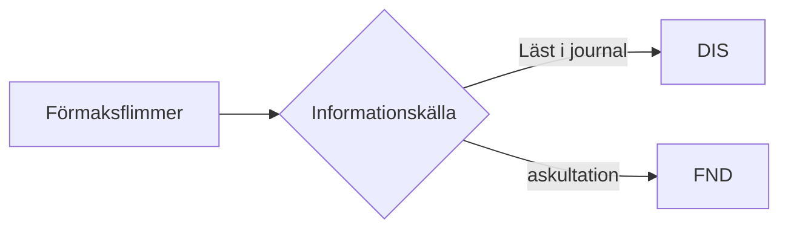

# Guidelines for annotation
## Introduction

### Selection and Design of entity classes

The main purpose of creating these guidelines to develop training data for models which can help better the identification and care of patients. The overarching principle is to annotate words and expressions as if in clinical reality. <!-- What do you mean "as if in clinical reality"? -->

The chosen classes and rules for priorities etc. are made in a attempt to balance identification of significant information for the patients medical history with continuity and and high inter annotator agreement. Class definitions are in part based on [SNOMED CT](https://confluence.ihtsdotools.org/display/DOCEG/Clinical+Finding+and+Disorder) definitions for findings and disease.

### Intended Users

These guidelines are intended to be used primarily by clinicians with experience in reading and writing patient records.

Annotation of medical text do usually come with the requirement of some expertise and some explanations may therefore seem arcane when it comes to medical issues as they are keep short for brevity assuming medical knowledge.<!-- This sentence is a really difficult read! Can you reframe? -->

### Guideline Creation Method
<!-- This description is fairly tecnical, consider adding a breif introduction/overview if the intended reader/user is a clinican with very limited NLP/annotation experience. -->
The aim is to create annotation guidelines which can be revised without breaking and handle exceptions. Principles<!--?--> and some syntax of object-oriented programming is used to help build such a system. The guidelines are built from the bottom up from definitions and axioms, taking inspiration from logics and mathematics.  A **definition** is held to be true in all contexts. It cannot be modified by further rules or exceptions. **Axioms** are a statements that are taken to be [true](https://www.wikiwand.com/en/Truth), either because they are self evident or because they are established principles. We use them here as statements that in the setting of clinical text mining are taken to be true intendent of specific annotation task. **Rules** are statements which can be applied under given circumstances to handle errors and exceptions, or modify the output of the annotation process. They are not held to be universally true and can modulate each other, that is they are mutable.

When altering the annotation process rules are to be considered first. In this way the base of the annotation process can remain intact and not break if the desired output of annotation is changed.

### Abbreviations

NE = Named Entity; Pat. = Patient, SYM = symptom when referred to as a NE, respective FND for finding and NEG for negation. Def = Definition

### Conventions used in the guidelines

- NE will be marked in text before the entity within bracets [ ]. If the entity spans more than one token curly bracets { } will be used to mark the start and end of span, e.g. [SYM]{Headache} <!-- Token here is not explained and has not been defined -->
- Comparison expression such as smaller than < and equal to == are sometimes used when they aid readability.

### ISSUES

- The model does not directly take into consideration the annotation guidelines
- Guidelines are somewhat inconsistent in syntax
- Hur är vi inkluderande från börjar så att vi inte tappar exempel.

  - Smärtproblematik – vill kunna dela upp senare.

### Future development
<!-- yes, we'll look into SNOMED CT and creating a symptom/finding list -->
Using definitions from SNOMED CT could help extend the guidelines while keeping compatibility. Some interesting things defined are:

- *Observable Entities. "The name of something that can be observed and represents a question or assessment which can produce an answer or result (e.g. |  systolic blood pressure|, |color of iris|, |gender|. For example, color of nail is an observable entity. Gray nails is a finding.*
- Disorders

There is also guides to [mapping from ICD to SNOMED](https://confluence.ihtsdotools.org/display/DOCICD10/ICD-10+Mapping+Technical+Guide) which could be of interest

## Definitions & Axioms

### Summary

- Words and expressions that are NE are to be marked as belonging to one of the following

  - *Symptom*: Subjective experience by the patient
  - *Signs*: A sign may be observed by another than the pat. or may be detected during anamnesis<!-- history taking --> or medical examination. They are to some degree objective indications of a disease, injury, or abnormal physiological state.
    - In Swedish: classically written under the heading of "akutellt"<!-- or Anmanes -->
  - *Negation*: Negerande enskilda ord såsom inte och ej + förled så som o i t.ex.
- Continuity: All instances of a NE which has the same function shall be labeled in the same manner across the corpus
  - E.g. negations should be categorized as such not only at symptoms but across the document.

### Definitions

#### def 1: Medical observations

A medically relevant **observation** with noticeable effect on the patient is either a **symptom** or a **finding** <!-- A symptom is something experienced by the patient, compared to a finding. Above the word *sign* is used. Which terminology should be adhered to, finding or sign? -->

#### def 2: Absence of Observation

The absence of an entity as defined by **def 1** is not a **symptom** or **finding**

#### def 3: Findings

If entity as defined by **def 1** is noticed from an observation made by a physician (or other medical personnel ) and/or is the result of a medical examination of the patient it is a **finding** <!-- If it defined here, remove it from def 1? Also sign or finding? Or is finding or symptoms sub-definitions of medical observations? Like 1.1 and 1.2? -->

#### def 4: Symptoms

If def 1 is apparent to the patient from the subjective experience induced by def 1 to the patient, it is a **symptom** <!-- See above -->

#### def 5: Negations

A **negation** is any construction which inverts or denies the default meaning of a word or statement that it affects.

#### def 6:  Entities Span

A named entity is a single OR sequential set of full tokens, i.e. only whole words and without leaps.

*<u>See spans of influence and compound words for example usage</u>*

------

### Axioms

#### Axiom 1: Context

The meaning of words and expressions defined by their natural or simulated context.

I.e. they should be interpreted as in a clinical context when written in a health record and at the part in which they are written, e.g. status or anamnesis.<!-- history instead of anamnesis. -->

#### Axiom 2: Who can make a finding

A **finding** can only be defined by someone with the adequate medical expertise

#### Axiom 3: Negated entities

In cases where entity and negations are separable entities are defined firstly without context in regards to negations, e.g. in:

*Ingen smärta*

The pain is judged before the negation is taken into consideration and is therefore a symptom and not the absence of a symptom, see. def 2. <!-- Sorry, just don't understand this. Is it because symptom comes before negations in the pipeline? Is it a current limitation? -->

#### Axiom 4: Shortest possible statement

The shortest possible statement that still adequately describe the finding or symptom is the entity. Therefore modifiers should be omitted if possible, e.g:

"beating [sym]{headache}" <!-- Should they always be capital letters? -->

"large [FND]{swelling on side of nose}"

In the second example "on side of nose" is a modifier of the root finding "swelling", but it is essential to fully describe the finding as swelling somewhere else could mean something entirely different. Compare to "headache on left side of the head"; the variations on headache are limited enough that it should be considered an entity in itself, i.e. it contains enough information to be self contained.

<u>This will be a decision that has to be made by the annotator, which add to the requirements of expertise</u> <!-- Yes, we'll need to think about this one! -->

#### Axiom 5: Temporal Aspect of Finding and Disease
<!-- Can you expand this a bit, it's not clear to me what this entails. -->
if a finding can be classified as a disease, which is a abnormal conditions that are not
momentary and that have an underlying pathological process, it is defined as a finding when discovered and when reported from previously known information it is not a finding, e.g. <!-- Sorry, not understanding this sentence. -->

*"Röntgen: Röntgen visar distal <u>[FND] radiusfraktur</u> med acceptabelt läge, minimalt disolocerad."*

*"Bedömning: Distal <u>radiusfraktur</u>, minimaldislokation"*

- May be normal (but not necessarily)
- May exist only at a single point in time (e.g. a serum sodium level)
- Cannot be temporally separate from the observation (one cannot observe them  and say they are absent, nor can they be present when they cannot be  observed)
- Cannot be defined only in terms of an underlying  pathological process that is present, when the observation itself is not present

#### Axiom 6: Continuity

Two entities that are equal to the patient are equal to each other and should therefore be annotated as the same entity class, <!-- I think this needs an example. :) -->

### Rules

#### Rule 1: Symptom has priority over finding

if an observation can be defined as both symptom and finding in it's context, symptom has priority. <!-- Agreed, needs example. -->

- SYM > FND

#### Rule 2: Ambiguity AND/OR Nestlings that are Irresolvable

If no clear meaning can be discerned AND/OR no annotation can be made that follows all definitions and axioms no annotation is to be made, e.g:

*"AT: Ligger på britsen, somnar snabbt undan men tittar upp vid tilltal. Hel och ren."*

Here a finding could perhaps have been that the patient was drowsy or sleepy, however, no annotation which truly confers this meaning can be made. The meaning of the

#### Rule 3: Assertions

No differentiation is to be made for different levels of certainty in assertions.

**Explanation**: When stating findings there are often assertions, of which negations are a type. Statements will range in degrees of certainty and also polarity (Affirming/Rejecting)

- has atrial fibrillation (A-fib)
- it's highly probable that the patient has A-fib
- It is possible that the patient has A-fib
- A-fib cannot be rejected
- No support for A-fib
- A-fib can be rejected

This example was adapted from Velupillai, S. (2012). Shades of Certainty: Annotation and Classification of Swedish Medical Records. PhD thesis, Stockholm University)

This is often more prevalent when describing diseases and hypothesis about diseases, where many negations are used.

## Use Cases & Examples

### COMPOUND EXPRESSIONS

#### Negations

*Status: AT: opåverkat i vila*

<u>*At this point "opåverkad" falls under def 2. and is therefore neither symptom or finding.*</u>

Here transforming all "opåverkad" to "ej påverkad" helps with automatically tagging the negations using's string matchers. This could be done in preprocessing in a later stage.

"påverkad i vila" = SYM
"o" = NEG

#### Symptoms & Findings

"Smärtpåverkad" is usually a finding whereas the experience of pain "smärta" is a symptom

### SPANS of INFLUENCE

*"Ingen smärta vid miktion buksmärta eller ÖHN symptom"*

The negation refers to both pain at mictuation and "ÖHN symptom". The conjugation of "ingen" would change if the sentence was uncompounded.

*"Ingen smärta vid miktion. Ingen buksmärta. Inga ÖHN symptom"*

Given this it would be

*"[NEG] Ingen [SYM] smärta vid miktion. [NEG] Ingen [SYM] buksmärta. [NEG] Inga [SYM] ÖHN symptom"*

To best reflect this in the original sentance the following annotation should be made

*"[NEG ] Ingen [SYM]{smärta vid miktion} [SYM] buksmärta eller [SYM] ÖHN symptom"*

### SOURCE of INFORMATION

#### External to health record

#### Internal to health record

Given that there are some conventions for what is written in what part of a health record this information may be used for deciding between SYM and FND, status usually holds findings and anamnesis symptoms.

This may influence, but not decide.

### MISSPELLINGS

If the meaning is discernable by annotator it should treat as if spelled correctly.

### MEASUREMENTS

Even given pathological measurements they should neither be annotated as SYM or FND.

Measurements should in future revisions be annotated as measurements MSR.

**Motivation**:

- The judgement of if a measurement falls within def 1 and def 2, that is if it is medically relevant and not only as the absence of a pathological measurement adds greater requirements on the annotator and adds possibilities for errors.

- In addition if classifying the measurements now they cannot easily be updated if changes to reference values are made.
