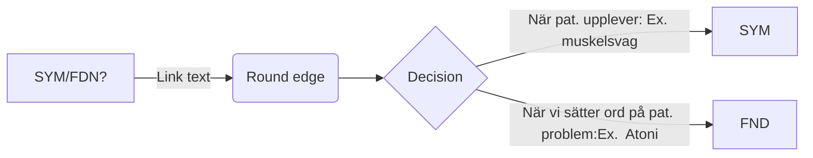
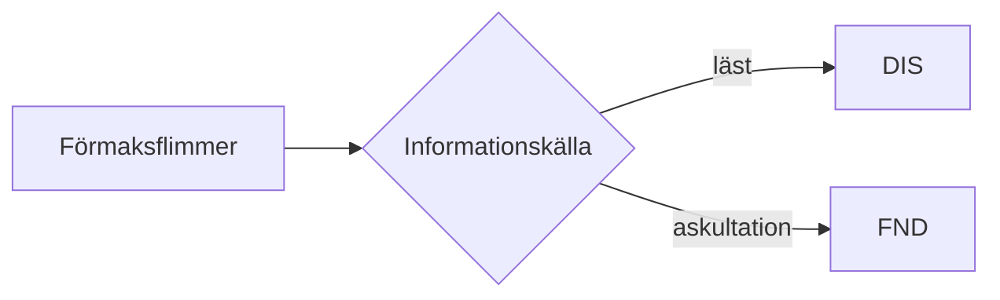

##  \<SYM> \<FND> classes
Förlångsammad, RLS 2

```mermaid

graph LR
S[SYM]
F[FND]
    A[SYM/FDN?] -->|Link text| B(Round edge)
    B --> C{Decision}
    C -->|När pat. upplever: Ex. muskelsvag| S
    C -->|När vi sätter ord på pat. problem:Ex.  Atoni| F
```

## Compound negations

Preprocess to "inte" + "lemma"

##  \<DIS> \<FND> classes
Gränser svår att se

```mermaid

graph LR
F[FND]
D[DIS]
    A[Förmaksflimmer] -->  C{Informationskälla}
    C -- läst --> D
    C -- askultation --> F
```